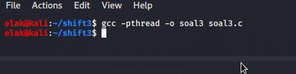
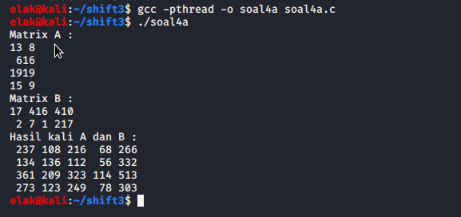
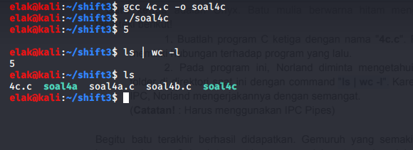

# SoalShiftSISOP20_modul3_T19

## Nama Angggota

- Adeela Nurul Fadhila [05311840000001]
- Muhammad Zulfikar Fauzi [05311840000012]

# Nomor 1

<p align="center">

</p>

# Nomor 2

Qiqi adalah sahabat MamMam dan Kaka. Qiqi , Kaka dan MamMam sangat senang
bermain “Rainbow six” bersama-sama , akan tetapi MamMam sangat Toxic ia selalu
melakukan Team killing kepada Qiqi di setiap permainannya. Karena Qiqi orang yang
baik hati, meskipun marah Qiqi selalu berkata “Aku nggk marah!!”. Kaka ingin
meredam kemarahan Qiqi dengan membuatkannya sebuah game yaitu TapTap
Game. akan tetapi Kaka tidak bisa membuatnya sendiri, ia butuh bantuan mu. Ayo!!
Bantu Kaka menenangkan Qiqi.

TapTap Game adalah game online berbasis text console. Terdapat 2 program yaitu
tapserver.c dan tapplayer.c

Syarat :
- Menggunakan Socket, dan Thread

Hint :
- fwrite, fread

Spesifikasi Game :

<p align="center"><b>
CLIENT SIDE
</b></p>

Screen 1 :
1. Login
2. Register\
Choices : {your input}

- Pada screen 1 kalian dapat menginputkan “login”, setelah menekan enter anda diminta untuk menginputkan username dan password seperti berikut

Screen 1 :
1. Login
2. Register\
Choices : login\
Username : { ex : qiqi }\
Password : { ex : aku nggak marah!! }

- Jika login berhasil maka akan menampilkan pesan “login success”, jika gagal akan menampilkan pesan “login failed” (pengecekan login hanya mengecek username dan password, maka dapat multi autentikasi dengan username dan password yang sama)
- Pada screen 1 kalian juga dapat menginputkan “register”, setelah menekan enter anda diminta untuk menginputkan username dan password sama halnya seperti login
- Pada register tidak ada pengecekan unique username, maka setelah register akan langsung menampilkan pesan “register success” dan dapat terjadi double account
- Setelah login berhasil maka anda berpindah ke screen 2 dimana menampilkan 2 fitur seperti berikut.

Screen 2 :
1. Find Match
2. Logout\
Choices : {your input}

- Pada screen 2 anda dapat menginputkan “logout” setelah logout anda akan kembali ke screen 1
- Pada screen 2 anda dapat menginputkan “find”, setelah itu akan menampilkan pesan “Waiting for player ...” print terus sampai menemukan lawan
- Jika menemukan lawan maka akan menampilkan pesan “Game dimulai silahkan tap tap secepat mungkin !!”
- Pada saat game dimulai diberikan variable health = 100,dan anda dapat men-tap (menekan space pada keyboard tanpa harus menekan enter)
- Pada saat anda men-tap maka akan menampilkan pesan “hit !!”, dan pada lawan healthnya akan berkurang sebanyak 10 kemudian pada lawan menampilkan pesan status healthnya sekarang. (conclusion : anda tidak bisa melihat status health lawan)
- Jika health anda <= 0 maka akan menampilkan pesan “Game berakhir kamu kalah”, apabila lawan anda healthnya <= 0 maka akan menampilkan pesan ”Game berakhir kamu menang”
- Setelah menang atau kalah maka akan kembali ke screen 2

<p align="center"><b>
SERVER SIDE
</b></p>

- Pada saat program pertama kali dijalankan maka program akan membuat file akun.txt jika file tersebut tidak ada. File tersebut digunakan untuk menyimpan username dan password
- Pada saat user berhasil login maka akan menampilkan pesan “Auth success” jika gagal “Auth Failed”
- Pada saat user sukses meregister maka akan menampilkan List account yang terdaftar (username dan password harus terlihat)

# Nomor 3

Buatlah sebuah program dari C untuk mengkategorikan file. Program ini akan
memindahkan file sesuai ekstensinya (tidak case sensitive. JPG dan jpg adalah
sama) ke dalam folder sesuai ekstensinya yang folder hasilnya terdapat di working
directory ketika program kategori tersebut dijalankan.
- Semisal program dijalankan:
```c
  # File kategori terletak di /home/izone/kategori
  $ ./kategori -f path/to/file1.jpg path/to/file2.c path/to/file3.zip
  #Hasilnya adalah sebagai berikut
  /home/izone
  |-jpg
  |--file1.jpg
  |-c
  |--file2.c
  |-zip
  |--file3.zi
```
- Pada opsi -f tersebut, user bisa menambahkan argumen file yang bisadikategorikan sebanyak yang user inginkan seperti contoh di atas.
- Pada program kategori tersebut, folder jpg,c,zip tidak dibuat secara manual,melainkan melalui program c. Semisal ada file yang tidak memiliki ekstensi,maka dia akan disimpan dalam folder “Unknown”.
- Program kategori ini juga menerima perintah (*) seperti di bawah;
```c
  $ ./kategori \*
```
- Artinya mengkategori seluruh file yang ada di working directory ketika menjalankan program C tersebut.
- Selain hal itu program C ini juga menerima opsi -d untuk melakukan kategori pada suatu directory. Untuk opsi -d ini, user hanya bisa menginput 1 directory saja, tidak seperti file yang bebas menginput file sebanyak mungkin.
```c
  $ ./kategori -d /path/to/directory/
```
 - Hasilnya perintah di atas adalah mengkategorikan file di /path/to/directory dan hasilnya akan disimpan di working directory di mana program C tersebut berjalan (hasil kategori filenya bukan di /path/to/directory).
- Program ini tidak rekursif. Semisal di directory yang mau dikategorikan, atau menggunakan (*) terdapat folder yang berisi file, maka file dalam folder tersebut tidak dihiraukan, cukup file pada 1 level saja.
- Setiap 1 file yang dikategorikan dioperasikan oleh 1 thread agar bisa berjalan secara paralel sehingga proses kategori bisa berjalan lebih cepat. Dilarang juga menggunakan fork-exec dan system.
- Silahkan download soal3.zip sebagai percobaan. Namun silahkan dicoba-coba sendiri untuk kemungkinan test case lainnya yang mungkin belum ada di soal3.zip.

#### Link code soal 3 :

##### Soal 3 : [Soal 3](https://github.com/bawangcode/SoalShiftSISOP20_modul3_T19/blob/master/soal3/soal3.c)

**Pembahasan**

```c
char cwd[100];
pthread_t threads[100];
pid_t child;
char *split_file[4],*split_path[20],nama_file[100],path[100];
int n = 0, m = 0;
```
- Pertama, dideklarasikan terlebih dahulu variabel yang akan digunakan

```c
int main(int argc, char *argv[]) {
    if(getcwd(cwd, sizeof(cwd)) != NULL) {
        // printf("Current working dir: %s\n", cwd);
    }
    int i=0,k=0;
	int p;
    if (strcmp(argv[1],"-f") == 0) {
        for(k = 2 ; k < argc ; k++ ){
            int p;
            pthread_create(&(threads[i]),NULL,move,argv[k]);
            pthread_join(threads[i],NULL);
            i++;
        }
    }
```
- Dilakukan pemanggilan fungsi getcwd untuk menyimpan path working directory sekarang, nantinya string path tsb akan disimpan pada array cwd.
- Kasus pertama, saat argumen ke dua yang inputkan di terminal adalah -f maka akan dilakukan pengecekan. Jika benar, maka akan membuat threads sebanyak jumlah path yang diinputkan pada terminal, dan akan memanggil fungsi move untuk melakukan pengecekan dan pemindahan file serta membuat directory.
- Jika 1 path telah selesai dilaksanakan maka akan melakukan proses join threads, dst nya

```c
void* move(void *arg) {
    strcpy(path,arg);
    char *temp,*temp1;

	unsigned long i=0;
	pthread_t id=pthread_self();
	int iter;

    temp1 = strtok(path, "/");
    while( temp1 != NULL ) {
        split_path[m] = temp1;
        m++;
        temp1 = strtok(NULL, "/");
    }
```
- Fungsi move = path yang diketikkan pada terminal akan disimpan dalam variabel arg lalu dicopy ke array path.
- Dilakukan pemisahan string path dengan fungsi strtok dimana string path tsb dipisahkan dengan field separatornya adalah tanda "/". 
- Hasil pemisahan dismpan dalam array split_path.

```c
strcpy(nama_file,split_path[m-1]);

temp = strtok(split_path[m-1], ".");
while( temp != NULL ) {

    split_file[n] = temp;
    n++;
    temp = strtok(NULL, ".");
}
```
- split_path[m-1] akan berisi sebuah nama file beserta ekstensinya yang didaptkan dari strtok("/"). 
- Nama file yang ada di split_path[m-1] tsb akan di copy ke array nama_file. 
- Nantinya akan dilakukan pemisahan lagi untuk mendapatkan ekstensi dari nama file tsb. Dilakukan pemisahan nama file berdasarkan tanda "." yang nantinya hasil pemisahan akan disimpan pada array split_file.

```c
char lowerall[100];
    strcpy(lowerall,split_file[n-1]);
    for(int i = 0; lowerall[i]; i++){
        lowerall[i] = tolower(lowerall[i]);
    }
```
- Karena pada soal ekstensi yang diinputkan di terminal tidak case yang sensitive, maka semua huruf ekstensi akan di kecilkan dengan menggunakan fungsi tolower

```c
DIR *folder, *folderopen;
    struct dirent *entry;
    char place2[100],place3[100];
    folder = opendir(cwd);
    int isdir = 0;
    printf("n = %d\n",n);
    if( n > 1 ){

        if(folder == NULL)
        {
            printf("error\n");
        }
        while( (entry=readdir(folder)) )
        {

            if(strcmp(entry->d_name,lowerall) == 0 && entry->d_type == 4){
                isdir = 1;
                break;
            }
        }
```
 - Dilakukan pengecekan apakah directory sekarang ada isinya atau tidak. Jika nilai n > 1 artinya file tsb memiliki ekstensi. 
 - Jika cwd ada isinya, akan dilakukan sebuah persyaratan, jika nama file pada directory tsb dengan array lowerall sama dan return data entry->d_type = 4(artinya merupakan sebuah direktori), maka variabel isdir di set sama dengan 1 yang merupakan sebuah penanda.
 
 ```c
   if(isdir == 0){

            strcpy(place2,cwd);
            strcat(place2,"/");
            strcat(place2,lowerall);
            mkdir(place2, 0777);

        }
    }
    else{
        strcpy(place2,cwd);
        strcat(place2,"/");
        strcat(place2,"Unknown");
        mkdir(place2, 0777);
    }
 ```
 - Variabel isdir dilakukan pengecekan lagi untuk melaksanakan pembuatan folder. 
 - Jika isdir = 0 (artinya bukan sebuah directory, namun sebuah file) maka akan dibuat folder yang path tujuan folder dibuatnya ada di bagian place2. 
 - Jika bukan, artinya file tidak memiliki ekstensi dan akan dibuat folder "Unknown".
 
 ```c
 else if (strcmp(argv[1],"-d") == 0 && argc == 3) {
        i = 0;
        DIR *fd, *fdo;
        struct dirent *folder;
        char pl1[100],pl2[100];

        fd = opendir(argv[2]);
        int isdir = 0;

        if(fd == NULL)
        {
            printf("error\n");
        }
        while( (folder=readdir(fd)) )
        {
            if ( !strcmp(folder->d_name, ".") || !strcmp(folder->d_name, "..") )
            continue;

            int p;
            strcpy(pl1,argv[2]);
            strcat(pl1,"/");
            strcat(pl1,folder->d_name);
            //is regular file
            if(folder->d_type == 8){
            pthread_create(&(threads[i]),NULL,move,pl1);
            pthread_join(threads[i],NULL);
            i++;
            }
        }
    }
 ```
 - Pada fungsi main , untuk kasus kedua dimana argumen kedua yang diketikkan pada terminal adalah * untuk memindahkan semua file dalam 1 level saja. Pada while, disitu ia akan melakukan pengecekan apakah sebuah direktori merupakan direktori berlevel atau tidak. 
- Jika ya, maka akan continue. Kemudian untuk dalam if(folder->d_type==8) dilakukan pengecekan jika return nya bernilai 8, maka merupakan folder tsb isinya adalah regular file, dan akan dilakukan pemindahan file-filenya kemudian dibuatkan folder sesuai ekstensinya.
 
 ```c
 else if (strcmp(argv[1],"-d") == 0 && argc == 3) {
        i = 0;
        DIR *fd, *fdo;
        struct dirent *folder;
        char pl1[100],pl2[100];

        fd = opendir(argv[2]);
        int isdir = 0;

        if(fd == NULL)
        {
            printf("error\n");
        }
        while( (folder=readdir(fd)) )
        {
            if ( !strcmp(folder->d_name, ".") || !strcmp(folder->d_name, "..") )
            continue;

            int p;
            strcpy(pl1,argv[2]);
            strcat(pl1,"/");
            strcat(pl1,folder->d_name);
            //is regular file
            if(folder->d_type == 8){
            pthread_create(&(threads[i]),NULL,move,pl1);
            pthread_join(threads[i],NULL);
            i++;
            }
        }
    }
 ```
 - Sama seperti case 2, tetapi disini akan memindahkan seluruh file yang ada dalam suatu path ke working directory. Maka yang di cek adalah argv[2] pada opendir karena disitu berisi nama path yang diketikkan pada terminal. 
 
 **Screenshot hasil :**\

 
# Nomor 4

Norland adalah seorang penjelajah terkenal. Pada suatu malam Norland menyusuri
jalan setapak menuju ke sebuah gua dan mendapati tiga pilar yang pada setiap
pilarnya ada sebuah batu berkilau yang tertancap. Batu itu berkilau di kegelapan dan
setiap batunya memiliki warna yang berbeda.
Norland mendapati ada sebuah teka-teki yang tertulis di setiap pilar. Untuk dapat
mengambil batu mulia di suatu pilar, Ia harus memecahkan teka-teki yang ada di
pilar tersebut. Norland menghampiri setiap pilar secara bergantian.

- __Batu mulia pertama.__ Emerald. Batu mulia yang berwarna hijau mengkilat. Pada
batu itu Ia menemukan sebuah kalimat petunjuk. Ada sebuah teka-teki yang berisi:

  1. Buatlah program C dengan nama "4a.c", yang berisi program untuk
melakukan perkalian matriks. Ukuran matriks pertama adalah 4x2, dan
matriks kedua 2x5. Isi dari matriks didefinisikan di dalam kodingan. Matriks
nantinya akan berisi angka 1-20 (tidak perlu dibuat filter angka).
  2. Tampilkan matriks hasil perkalian tadi ke layar.
  
- __Batu kedua__ adalah Amethyst. Batu mulia berwarna ungu mengkilat. Teka-tekinya
adalah:

  1. Buatlah program C kedua dengan nama "4b.c". Program ini akan
mengambil variabel hasil perkalian matriks dari program "4a.c" (program
sebelumnya), dan tampilkan hasil matriks tersebut ke layar.
(Catatan!: gunakan shared memory)
  2. Setelah ditampilkan, berikutnya untuk setiap angka dari matriks
tersebut, carilah nilai faktorialnya, dan tampilkan hasilnya ke layar dengan format seperti matriks.

    Contoh: misal array [[1, 2, 3, 4], [5, 6, 7, 8], [9, 10, 11, 12], ...],

    maka:

    1 2 6 24
    120 720 ... ...
    ...

    (__Catatan!__ : Harus menggunakan Thread dalam penghitungan faktorial)

- __Batu ketiga__ adalah Onyx. Batu mulia berwarna hitam mengkilat. Pecahkan
teka-teki berikut!

  1. Buatlah program C ketiga dengan nama "4c.c". Program ini tidak
memiliki hubungan terhadap program yang lalu.
  2. Pada program ini, Norland diminta mengetahui jumlah file dan
folder di direktori saat ini dengan command "ls | wc -l". Karena sudah belajar
IPC, Norland mengerjakannya dengan semangat.

  (__Catatan!__ : Harus menggunakan IPC Pipes)

Begitu batu terakhir berhasil didapatkan. Gemuruh yang semakin lama semakin
besar terdengar. Seluruh tempat berguncang dahsyat, tanah mulai merekah. Sebuah
batu yang di atasnya terdapat kotak kayu muncul ke atas dengan sendirinya.

Sementara batu tadi kembali ke posisinya. Tanah kembali menutup, seolah tidak
pernah ada lubang merekah di atasnya satu detik lalu.
Norland segera memasukkan tiga buah batu mulia Emerald, Amethys, Onyx pada
Peti Kayu. Maka terbukalah Peti Kayu tersebut. Di dalamnya terdapat sebuah harta
karun rahasia. Sampai saat ini banyak orang memburu harta karun tersebut.
Sebelum menghilang, dia menyisakan semua petunjuk tentang harta karun tersebut
melalui tulisan dalam buku catatannya yang tersebar di penjuru dunia. "One Piece
does exist".

#### Link code soal 4 :

##### Soal 4a : [shift4a](https://github.com/bawangcode/SoalShiftSISOP20_modul3_T19/blob/master/soal4/soal4a.c)

##### Soal 4c : [shift4c](https://github.com/bawangcode/SoalShiftSISOP20_modul3_T19/blob/master/soal4/soal4c.c)

**Pembahasan**

#### 4a.
``` c
int matrixA[4][2];
int matrixb[2][5];
int matrixc[4][5];
```
- Pertama deklarasikan dulu matriks sesuai yang diinginkan soal.
``` c
void* buat_kali(void* arg) {
  if(kolom >= 5){
    kolom = 0;
    baris++;
  }
  for(int i = 0; i < 2;i++){
    matrixc[baris][kolom] += matrixA[baris][i] * matrixb[i][kolom];
  }
  kolom++;
}
```
- Rumuskan fungsi untuk perkalian matriks.
``` c
srand(time(NULL));
  printf("Matrix A : \n");
  for (int i = 0; i < 4; i++) {
    /* code */
    for (int j = 0; j < 2; j++) {
      matrixA[i][j] = rand()%19+1;
      printf("%2d", matrixA[i][j]);
      /* code */
    }
    printf("\n");
  }
```
- __srand(time(NULL));__ digunakan untuk mengenerate random number.
- Lalu kita gunakan 2 perulangan untuk mengisi matriks A menggunakan __rand()%19+1__, random berfungsi untuk menghasilkan angka random dengan batas angka 1-20 ( __%19+1__).
- Lakukan hal yang sama pada matriks B.
``` c
 pthread_t tid[20];

  for (int i = 0; i < 20; i++) {
    /* code */
    pthread_create(&(tid[i]), NULL, &buat_kali, NULL);
  }
  
  for (int i = 0; i < 20; i++) {
    /* code */
    pthread_join(tid[i], NULL);
  }
```
- Setelah itu kita deklarasikan thread.
- Kita gunakan perulangan untuk menjalankan fungsi __pthread_create__ dengan syntax untuk menjalankan fungsi perkalian tadi.
- Setelah itu kita lakukan __pthread_join()__ untuk masing - masing thread agar __main()__ tidak berhenti sebelum masing - masing thread selesai prosesnya.
``` c
printf("Hasil kali A dan B :\n");
  for (int i = 0; i < 4; i++) {
    /* code */
    for (int j = 0; j < 5; j++) {
      printf("%4d", matrixc[i][j]);
      /* code */
    }
    printf("\n");
  }
```
- Setelah perkalian selesai maka kita tampilkan matriks C menggunakan perulangan.

**Screenshot hasil :**\


#### 4c.
``` c
int deskriptor[2];
  pid_t pid;
  pipe(deskriptor);
```
- Pertama - tama kita buat variabel array berdasarkan jumlah pipe yang kita perlukan,. dalam kasus ini karena kita hanya perlu 1 pipe maka __\[2]__ cukup. Lakukan fungsi pipe pada variabel tersebut.
``` c
if (pid == 0) {
    dup2(deskriptor[1], 1);
    close(deskriptor[0]);
    close(deskriptor[1]);
    char *argv[] = {"ls", NULL};
    execv("/bin/ls", argv);
    }
```
- Proses pertama, kita lakukan __ls__ menggunakan __execv()__. Agar output dari execv masuk dalam pipe kita gunakan fungsi __dup2__.
- __dup2__ berfungsi untuk menyamakan isi dari 2 yang disebut, __deskriptor\[1]__ dan __1__. 1 disini adalah STDOUT ( output yang mengarah ke terminal ) sedangkan __deskriptor\[1]__ adalah lubang output dari pipe kita.
- Maka hasil dari ls akan masuk ke dalam pipe.
``` c
if (pid == 0) {
    dup2(deskriptor[0], 0);
    close(deskriptor[0]);
    close(deskriptor[1]);
    char *argv[] = {"wc", "-l", NULL};
    execv("/usr/bin/wc", argv);
  }
```
- Lalu untuk proses selanjutnya kita ambil output dari __ls__ dari pipe kita gunakan sebagai input untuk fungsi __wc__ yang akan dijalankan menggunakan __execv__.
- Caranya adalah melakukan __dup2__ pada __deskriptor\[0]__ dan __0__. 0 disini adalah STDIN atau input. __deskriptor\[0]__ adalah lubang input dari pipe.
- Setelah itu karena outputnya default ( STDOUT ) maka hasil dari dc akan ditampilkan pada terminal.

**Screenshot hasil :**\


# Kesulitan/Kendala yang Dialami
1. Kami masih menyesuaikan diri dengan sistem operasi LINUX/Ubuntu sehingga ada beberapa kendala dalam menggunakan terminal.
2. Soal sangat jauh diatas kemampuan kami terutama nomor 1.
3. Banyak command baru yang kami belum pernah dengar maupun gunakan sebelumnya.
4. Kami belum memahami dengan penuh yang diberikan pada modul 3. Karena sesi lab nya juga online, dan terkadang share screen nya buram, sehingga sulit dibaca apalagi dimengerti
5. Karena keadaan yang WFH, kami sulit untuk berdiskusi atau mengerjakan bersama. Selain itu kami biasa mengerjakan di lab karena laptop kami memang agak bermasalah, sedangkan kondisi sekarang adalah WFH sehingga mau tidak mau kami harus mengerjakan di rumah.
6. Salah satu anggota tidak memiliki laptop (sedang diservis), dan yang satunya lagi laptopnya agak bermasalah di SSD nya, sehingga sulit sekali untuk menyelesaikan modul ini.
